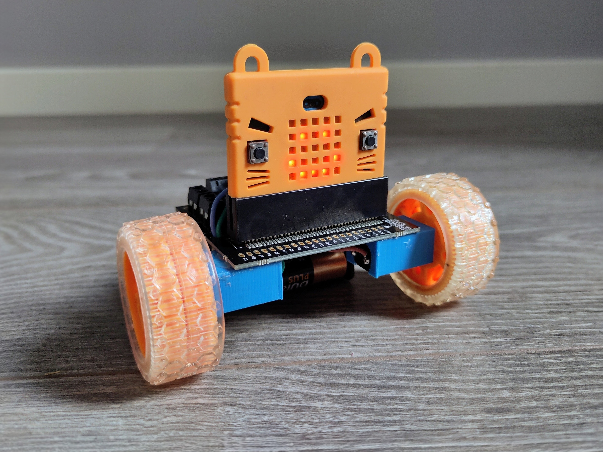

It has been over a year since I last built a robot, I can hardly believe it! 🤖

I dug around through my boxes of craft supplies and electronics to give Bibliobot a body, and realised that I need to do an inventory - that is a project for another time though.

I was not organised enough to have all the parts I needed for my 'normal' micro:bit robot build - which went through many improvements over the years at my previous job - without taking things apart, so I made do with a selection of spare components instead just to get the ball rolling.

<!--more-->
## Components List
### **micro:bit** v1
I learnt from experience that these cope better than the v2s with slightly dodgy power electronics, so while I am prototyping I will use an old one so I don't damage it!

It is temporarily in a 'Kittenbot' case because I forgot I had it and it's adorable.

### Kitronik **Edge Connector Motor Driver** v2.0
This is all of the electronics in one, nice and easy, and also acts as a base.

It powers both the micro:bit and the motors at the same time, but doesn't have a power switch. My preference is a separate, very obvious, off button so I don't need to unplug anything to turn it off, so I will add one when I redesign, at which point I will probably replace this whole motor driver with my own board anyway.

### Slow N20 **motors**, 60rpm?
I am not really sure why I own such slow turning motors, however they work quite well for this robot.

A library robot shouldn't be zooming around too quickly - slow and precise movements are more sensible - and it's basically impossible to accidentally drive it off a table this way too!

### Individual 3D printed motor brackets
These make it easy to glue the motors in place for prototyping.

When I do the full redesign I will build these into the base, so that the motors can't move out of position and affect the driving.

[The CAD files can be found on Printables](https://www.printables.com/model/669433-n20-motor-bracket)

### 4x AA **batteries**
These are not ideal, they are heavy and take up space. I used LiPo batteries in my older robots, but the Kitronik motor driver needed 4.5-6V, so AAs will do for now.

### Pimoroni orange **wheels**
My favourite wheels! They are nice and grippy, and look cute too. I am not planning to swap these out.

## Code
I used test code only, to make sure that the motors turned as expected, with no radio control for now, as I can't find my joystick controller!

Working code from my old robots can be found on Github: [Out of Micro:Trol](https://github.com/Isioviel/out-of-micro-trol)

The pin mapping for Bibliobot is:
- Left-Forward = pin16
- Left-Backward = pin0
- Right-Forward = pin12
- Right-Backward = pin8